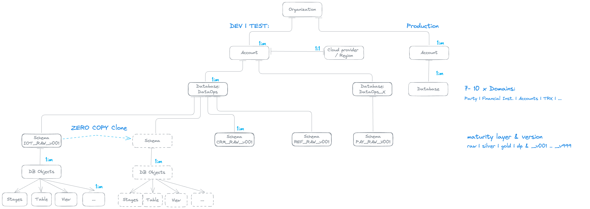
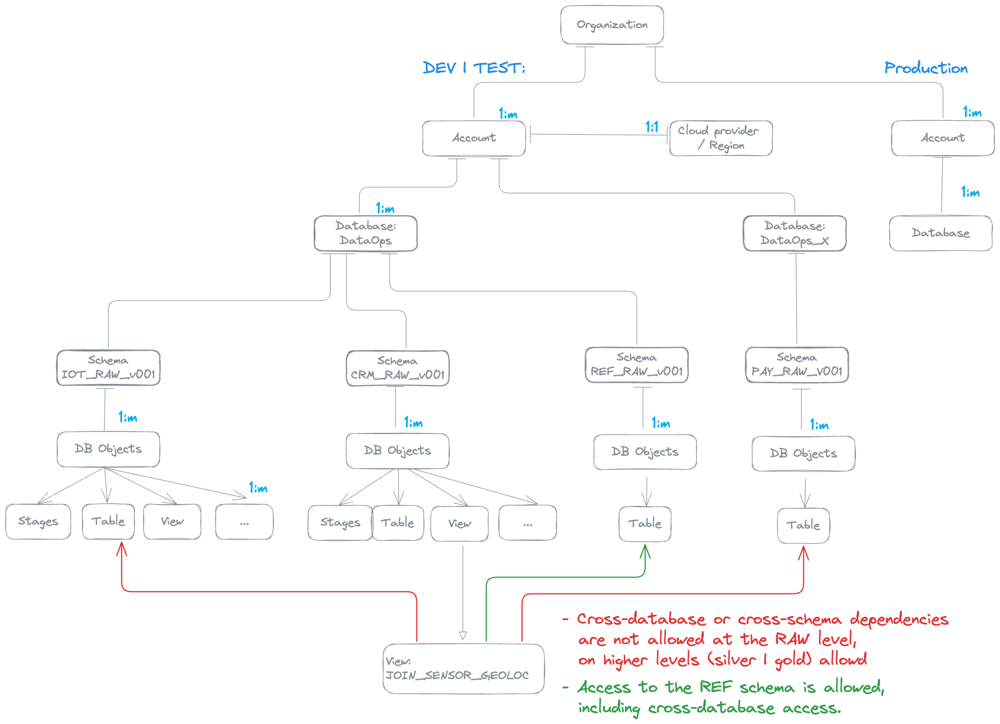

# **DataOps Unchained: Infrastructure that Scales**

[](https://github.com/zBrainiac/mother-of-all-Projects/actions/workflows/update-local-repo.yml)
[](https://github.com/zBrainiac/sql_quality_check/actions/workflows/docker-publish.yml)

> **A hands-on reference architecture for fully automated SQL code quality pipelines using SonarQube, GitHub Actions, and Snowflake.**

---

## Why / What / How

### Why?
#### In large, federated organizations, scaling analytics isn’t (just) a tech challenge — it’s an operational one.

From a technological and operational perspective, automation, governance and consistency are vital for scaling analytics in large, federated organisations. With agile methodology and modularisation, deployment volume can rise to hundreds or thousands per day, so manual QA simply cannot keep pace. For example, if 15 analytics teams were to deploy changes daily, the number of full-time reviewers required for manual reviews would be prohibitively high, resulting in bottlenecks, missed checks and an increased risk of inconsistent standards and data incidents.
DataOpsBackbone addresses these issues by automating every critical step:

**Quality Gates** leverage **SonarQube** code scans to enforce SQL and customisable coding rules based on regular expressions, which are applied automatically with every git push request. For example, forgetting to prefix a schema name or hardcoding a database name triggers an automated block and feedback, thereby enforcing standards before code can be shipped.
- Releases are versioned and tested against zero-copy clones before being packaged through structured, traceable GitHub Actions workflows. This keeps production safe from changes that have not been properly tested.
- Governance is built in: rules such as 'no grants to PUBLIC' or 'only UTC TIMESTAMP allowed' are continuously enforced, and all compliance-relevant data (such as SQL code scans and test results) is logged for auditing purposes.
- Teams have full transparency and can be agile and reduce technical debt themselves. Automation enforces rules and monitors testing over time, so centralised approvals no longer become a bottleneck.

This setup offers repeatability, auditability and peace of mind, enabling new teams to get up and running quickly and allowing developers to focus on creating value rather than policing standards. The showcased projects are practical blueprints for achieving reliable, scalable analytics operations with Snowflake and GitHub Actions, not just demos.


This showcase project, together with [**Mother-of-all-Projects**](https://github.com/zBrainiac/mother-of-all-Projects) — demonstrates a fully automated DataOps setup designed to enforce SQL code quality, structure release flows, and scale confidently with Snowflake and GitHub Actions.

---

### What?

A DataOps pipeline that automates:

- Syncing changes from GitHub
- SQL linting & validation (SonarQube + regex rules)
- Zero-copy Snowflake DB cloning
- Building and testing releases
- Packaging deployable artifacts

#### Overview of the infrastructure:


---

### How?

It combines:

- **GitHub Actions** (with custom self-hosted runners)
- **SonarQube** extended with SQL & Text plugins
- **Docker Compose** for local stack orchestration
- **Snowflake CLI** for deployment and zero-copy cloning
- **SQLUnit** for automated SQL testing

---

## Project Structure

- **[mother-of-all-Projects](https://github.com/zBrainiac/mother-of-all-Projects)**  
  GitHub workflows, SQL refactoring logic, Snowflake deployment scripts, and validation via SQLUnit.

- **[DataOps Backbone](https://github.com/zBrainiac/DataOpsBackbone)**  
  Dockerized infrastructure stack for:
  - SonarQube + PostgreSQL
  - GitHub self-hosted runners
  - Local development/testing

---
## Architecture Overview - Data objects

The showcase is built around two distinct data domains, each represented as an individual database within the same Snowflake account. This approach allows for logical isolation and independent management of domain-specific data assets.

Within each domain (database), schemas are strategically utilized to achieve two key objectives:
* **Maturity Levels:** Schemas separate data objects based on their maturity level (e.g., raw, curated, conformed). This provides a clear path for data as it progresses through various transformation stages.
* **Versioning:** Schemas also incorporate versioning for underlying database objects like tables, views, stages and procedures. This ensures traceability, facilitates rollbacks, and supports agile development by allowing iterative changes without disrupting existing consumers.

### Why This Approach?
1. **Improved Organization:** Data assets are logically grouped by business domain, making them easier to discover and manage.
2. **Enhanced Data Governance:** Clear maturity levels and versioning promote better control over data quality and evolution.
3. **Scalability & Maintainability:** The modular design reduces interdependencies, simplifying development, testing, and maintenance.
4. **Demonstrates Best Practices:** Provides a practical example of implementing a domain-driven data architecture in Snowflake.




### Drive modularization for better Resilience

We not only use static source code analysis to review new code coming into the environment, but also check the existing setup and enforce isolation more effectively.
By isolating domains and versions, the impact of changes or failures in one area on others is minimised, thereby enhancing overall system stability and aiding regression testing.


---
## SQL Linting Rules and Regex Patterns
This list provides a few examples of SQL validation rules, each of which is paired with a regular expression (regex) that can be used to identify non-compliant code using the Community Text plugin of SonarQube.

Backups of these rules, which can be restored as a Quality Profile, are available in the repository ([link](backup/2025-08-04_quality_profiles_text_plugin.xml)).

#### 1. Disallow `CREATE SCHEMA` without `IF NOT EXISTS` or `REPLACE`
```regex
(?i)^\s*CREATE\s+(?!OR\s+REPLACE\b)(?!.*\bIF\s+NOT\s+EXISTS\b).*?\bSCHEMA\b
```

#### 2. Disallow CREATE TABLE without IF NOT EXISTS or REPLACE
```regex
(?is)^(?!\s*--).*CREATE\s+(?!OR\s+REPLACE\b|.*IF\s+NOT\s+EXISTS\b).*TABLE\b
```

#### 3. Disallow CREATE statements with hardcoded database and/or schema prefix
```regex
(?i)^(?!\s*--)\s*create\s+(or\s+replace\s+)?(table|view|schema)\s+(if\s+not\s+exists\s+)?[a-z0-9_]+\.[a-z0-9_]+(\.[a-z0-9_]+)?
```

#### 4. Disallow GRANT statements to PUBLIC
```regex
(?i)^(?!\s*--).*grant\s+.*\s+to\s+public\b
```

#### 5. Disallow dropping objects without IF EXISTS
```regex
(?i)^\s*DROP\s+(SCHEMA|TABLE|VIEW)\s+(?!IF\s+EXISTS\b)
```

#### 6. Disallow hardcoded USE DATABASE, USE SCHEMA, or USE ROLE statements
```regex
(?i)^(?!\s*--)\s*USE\s+(DATABASE|SCHEMA|ROLE)\b
```

#### 7. Disallow usage of TIMESTAMP types other than TIMESTAMP_TZ
```regex
(?i)(?<!--.*)\bTIMESTAMP(_NTZ|_LTZ)?(\s*\(\s*\d+\s*\))?\b
```

#### 8. Schema names must have a prefix (RAW_, REF_, CON_, AGG_, DP_, DM_)
```regex
(?i)^(?!\s*--)\s*CREATE\s+(OR\s+REPLACE\s+)?SCHEMA\s+(IF\s+NOT\s+EXISTS\s+)?(?:[a-z0-9_]+\.)?(?!RAW_|REF_|CON_|AGG_|DP_|DM_)[a-z0-9_]+;
```

#### 9. (Dynamic) Table | Views names must begin with a 3-character alphanumeric component code followed by an underscore
```regex
(?i)^(?!\s*--)(?:\s*create(?:\s+or\s+replace)?|\s*alter)\s+(dynamic\s+)?table\s+(if\s+not\s+exists\s+)?(?:[A-Z0-9_]+\.){0,2}(?![A-Z0-9]{3}_)[A-Z_][A-Z0-9_]*
```

#### 10. Disallow Cross-Database Dependencies
```regex
^.*cross_db_true.*$
```

#### 11. Disallow Cross-Schema Dependencies
```regex
^.*cross_schema_true.*$
```

## Monitoring
### Issue overview


### Issue within code


### Technical dept


### Monitor the history of test case execution


## Quick Setup Guide


### Step 1: Create all Snowflake objects
The [DataOps_init.sql](DataOps_init.sql) script creates all required database objects, including users and roles.
Simply log in to your Snowflake account and create all your objects at once.


### Step 2: Snowflake Config


```SQL
ALTER USER IF EXISTS SVC_CICD ADD PAT CICD_PAT ROLE_RESTRICTION = 'ACCOUNTADMIN' DAYS_TO_EXPIRY = 30 COMMENT = 'New PAT for Snow CLI';
-- copy <your token>

SHOW USER PATS FOR USER SVC_CICD;
```

Create a snow cli config `~/.snowflake/config.toml`
```toml
[connections.sfseeurope-svc_cicd_user]
account = "sfseeurope-demo_mdaeppen"
user = "SVC_CICD"
database = "DATAOPS"
schema = "IOT_RAW_v001"
warehouse = "MD_TEST_WH"
authenticator = "snowflake"
password = "<your token>"
```

Create a local `.env` for testing
```dotenv
# GitHub
GH_RUNNER_TOKEN=<...>
GITHUB_OWNER=<your GitRepo>
GITHUB_REPO_1=<your Projects>

# SonarQube
POSTGRES_USER=<...>
POSTGRES_PASSWORD=<...>
POSTGRES_DB=<...>
SONAR_JDBC_USERNAME=<...>
SONAR_JDBC_PASSWORD=<...>

# Snowflake
CONNECTION_NAME=sfseeurope-svc_cicd
```

---
### Step 3: Encode & Upload Secrets

```bash
base64 -b 0 -i ~/.snowflake/config.toml | tr -d '\n' > SNOW_CONFIG_B64
```

Upload the following secrets to GitHub repo:

- `SNOW_CONFIG_B64`
- `SONAR_TOKEN` (see below step 3.)

---
### Step 4: Generate a SONAR_TOKEN (for user `ci_user`)

1. Start your local stack via `./start.sh`
2. Log in to SonarQube [http://localhost:9000](http://localhost:9000) as `admin`
3. Go to **My Account** > **Security**
4. Under **Generate Tokens**:
 - **Name** the token (e.g., `ci_user`)
 - **Type** of the token `global analysis token`
 - Click **Generate**
5. Copy the token (you won’t see it again).
6. Use as `SONAR_TOKEN` in your CI/CD pipeline.

---

### Step 5: Run It

1. Start your local stack via `./start.sh`
2. Access SonarQube at: [http://localhost:9000](http://localhost:9000)  
  **Login**: `admin` / `ThisIsNotSecure1234!` (default 'admin')
3. Trigger your GitHub workflow
4. Check results in sonarqube 
5. monitor SQLUnit test results (incl. history) at: [http://localhost:8080](http://localhost:9080/index.html)

---

## Final Thoughts

This is not just a demo. It's a **reusable framework** to scale DataOps — combining validation, governance, and automation into one consistent, testable workflow.
